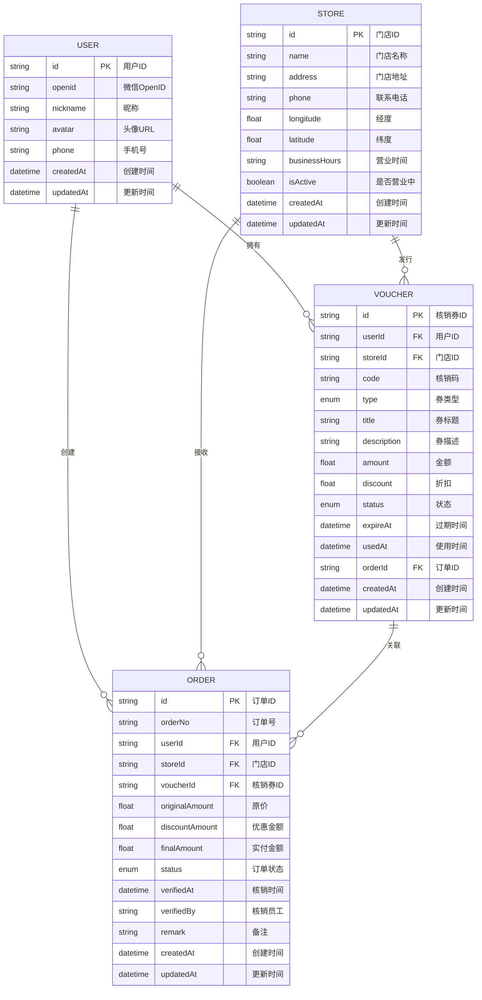

# 数据模型设计

## 实体关系图



## TypeScript 接口定义

### 枚举类型

```typescript
/**
 * 核销券类型
 */
export enum VoucherType {
  /** 代金券 */
  CASH = 'CASH',
  /** 折扣券 */
  DISCOUNT = 'DISCOUNT',
  /** 兑换券 */
  EXCHANGE = 'EXCHANGE',
  /** 体验券 */
  TRIAL = 'TRIAL'
}

/**
 * 核销券状态
 */
export enum VoucherStatus {
  /** 未使用 */
  UNUSED = 'UNUSED',
  /** 已使用 */
  USED = 'USED',
  /** 已过期 */
  EXPIRED = 'EXPIRED',
  /** 已冻结 */
  FROZEN = 'FROZEN'
}

/**
 * 订单状态
 */
export enum OrderStatus {
  /** 待支付 */
  PENDING = 'PENDING',
  /** 已支付 */
  PAID = 'PAID',
  /** 已核销 */
  VERIFIED = 'VERIFIED',
  /** 已取消 */
  CANCELLED = 'CANCELLED',
  /** 已退款 */
  REFUNDED = 'REFUNDED'
}
```

### 实体接口

```typescript
/**
 * 用户实体
 */
export interface User {
  /** 用户ID */
  id: string
  /** 微信OpenID */
  openid: string
  /** 昵称 */
  nickname: string
  /** 头像URL */
  avatar: string
  /** 手机号 */
  phone?: string
  /** 创建时间 */
  createdAt: Date
  /** 更新时间 */
  updatedAt: Date
}

/**
 * 门店实体
 */
export interface Store {
  /** 门店ID */
  id: string
  /** 门店名称 */
  name: string
  /** 门店地址 */
  address: string
  /** 联系电话 */
  phone: string
  /** 经度 */
  longitude: number
  /** 纬度 */
  latitude: number
  /** 营业时间 */
  businessHours: string
  /** 是否营业中 */
  isActive: boolean
  /** 创建时间 */
  createdAt: Date
  /** 更新时间 */
  updatedAt: Date
}

/**
 * 核销券实体
 */
export interface Voucher {
  /** 核销券ID */
  id: string
  /** 用户ID */
  userId: string
  /** 门店ID */
  storeId: string
  /** 核销码 */
  code: string
  /** 券类型 */
  type: VoucherType
  /** 券标题 */
  title: string
  /** 券描述 */
  description: string
  /** 金额(代金券) */
  amount?: number
  /** 折扣(折扣券,0.1-1.0) */
  discount?: number
  /** 状态 */
  status: VoucherStatus
  /** 过期时间 */
  expireAt: Date
  /** 使用时间 */
  usedAt?: Date
  /** 关联订单ID */
  orderId?: string
  /** 创建时间 */
  createdAt: Date
  /** 更新时间 */
  updatedAt: Date
}

/**
 * 订单实体
 */
export interface Order {
  /** 订单ID */
  id: string
  /** 订单号 */
  orderNo: string
  /** 用户ID */
  userId: string
  /** 门店ID */
  storeId: string
  /** 核销券ID */
  voucherId?: string
  /** 原价 */
  originalAmount: number
  /** 优惠金额 */
  discountAmount: number
  /** 实付金额 */
  finalAmount: number
  /** 订单状态 */
  status: OrderStatus
  /** 核销时间 */
  verifiedAt?: Date
  /** 核销员工 */
  verifiedBy?: string
  /** 备注 */
  remark?: string
  /** 创建时间 */
  createdAt: Date
  /** 更新时间 */
  updatedAt: Date
}
```

### DTO 接口

```typescript
/**
 * 核销券列表项(用户端)
 */
export interface VoucherListItem {
  id: string
  code: string
  type: VoucherType
  title: string
  description: string
  amount?: number
  discount?: number
  status: VoucherStatus
  expireAt: Date
  storeName: string
  storeAddress: string
}

/**
 * 核销券详情(用户端)
 */
export interface VoucherDetail extends VoucherListItem {
  usedAt?: Date
  orderId?: string
  orderNo?: string
  storePhone: string
  businessHours: string
  longitude: number
  latitude: number
}

/**
 * 订单列表项
 */
export interface OrderListItem {
  id: string
  orderNo: string
  originalAmount: number
  discountAmount: number
  finalAmount: number
  status: OrderStatus
  storeName: string
  createdAt: Date
  verifiedAt?: Date
}

/**
 * 订单详情
 */
export interface OrderDetail extends OrderListItem {
  storeAddress: string
  storePhone: string
  voucherTitle?: string
  voucherType?: VoucherType
  verifiedBy?: string
  remark?: string
}

/**
 * 门店详情
 */
export interface StoreDetail {
  id: string
  name: string
  address: string
  phone: string
  longitude: number
  latitude: number
  businessHours: string
  isActive: boolean
}
```

### 请求/响应接口

```typescript
/**
 * 核销券列表请求参数
 */
export interface GetVoucherListParams {
  /** 状态筛选 */
  status?: VoucherStatus
  /** 券类型筛选 */
  type?: VoucherType
  /** 页码 */
  page?: number
  /** 每页数量 */
  pageSize?: number
}

/**
 * 核销券列表响应
 */
export interface GetVoucherListResponse {
  /** 核销券列表 */
  items: VoucherListItem[]
  /** 总数 */
  total: number
  /** 当前页 */
  page: number
  /** 每页数量 */
  pageSize: number
  /** 总页数 */
  totalPages: number
}

/**
 * 核销券详情响应
 */
export interface GetVoucherDetailResponse {
  voucher: VoucherDetail
}

/**
 * 订单列表请求参数
 */
export interface GetOrderListParams {
  /** 状态筛选 */
  status?: OrderStatus
  /** 页码 */
  page?: number
  /** 每页数量 */
  pageSize?: number
}

/**
 * 订单列表响应
 */
export interface GetOrderListResponse {
  /** 订单列表 */
  items: OrderListItem[]
  /** 总数 */
  total: number
  /** 当前页 */
  page: number
  /** 每页数量 */
  pageSize: number
  /** 总页数 */
  totalPages: number
}

/**
 * 订单详情响应
 */
export interface GetOrderDetailResponse {
  order: OrderDetail
}

/**
 * 门店详情响应
 */
export interface GetStoreDetailResponse {
  store: StoreDetail
}

/**
 * 统一API响应格式
 */
export interface ApiResponse<T = any> {
  /** 状态码 */
  code: number
  /** 消息 */
  message: string
  /** 数据 */
  data?: T
  /** 时间戳 */
  timestamp: number
}
```

## MySQL表结构

```sql
-- ==============================================================
-- 数据库: grainPro
-- 表前缀: grain_
-- 字符集: utf8mb4
-- 时间戳: INT(10) 10位Unix时间戳
-- ==============================================================

-- 用户表扩展(FastAdmin内置表grain_user)
-- 需要添加以下字段:
ALTER TABLE `grain_user`
ADD COLUMN `openid` VARCHAR(64) DEFAULT NULL COMMENT '微信openid' AFTER `email`,
ADD COLUMN `region_code` VARCHAR(20) DEFAULT NULL COMMENT '地区编码' AFTER `openid`,
ADD UNIQUE INDEX `idx_openid` (`openid`);

-- 核销券表
CREATE TABLE `grain_voucher` (
  `id` INT(10) UNSIGNED NOT NULL AUTO_INCREMENT PRIMARY KEY COMMENT '核销券ID',
  `code` VARCHAR(32) UNIQUE NOT NULL COMMENT '核销券码(全局唯一)',
  `order_id` INT(10) UNSIGNED NOT NULL COMMENT '订单ID',
  `user_id` INT(10) UNSIGNED NOT NULL COMMENT '用户ID',
  `category_id` INT(10) UNSIGNED NOT NULL COMMENT '大米分类ID',
  `region_code` VARCHAR(20) NOT NULL COMMENT '适用地区编码',
  `type` ENUM('cash','discount','exchange','trial') DEFAULT 'cash' COMMENT '券类型:代金券,折扣券,兑换券,体验券',
  `title` VARCHAR(100) NOT NULL COMMENT '券标题',
  `description` TEXT DEFAULT NULL COMMENT '券描述',
  `amount` DECIMAL(10,2) DEFAULT NULL COMMENT '金额(代金券专用)',
  `discount` DECIMAL(3,2) DEFAULT NULL COMMENT '折扣(折扣券专用,0.10-0.99)',
  `status` ENUM('unused','used','expired','frozen') DEFAULT 'unused' COMMENT '状态:未使用,已使用,已过期,已冻结',
  `expire_at` INT(10) UNSIGNED NOT NULL COMMENT '过期时间戳',
  `used_at` INT(10) UNSIGNED DEFAULT NULL COMMENT '核销时间戳',
  `used_store_id` INT(10) UNSIGNED DEFAULT NULL COMMENT '核销门店ID',
  `createtime` INT(10) UNSIGNED DEFAULT NULL COMMENT '创建时间',
  `updatetime` INT(10) UNSIGNED DEFAULT NULL COMMENT '更新时间',
  INDEX `idx_user_status` (`user_id`, `status`),
  INDEX `idx_expire` (`expire_at`),
  INDEX `idx_code` (`code`)
) ENGINE=InnoDB DEFAULT CHARSET=utf8mb4 COMMENT='核销券表';

-- 门店表
CREATE TABLE `grain_store` (
  `id` INT(10) UNSIGNED NOT NULL AUTO_INCREMENT PRIMARY KEY COMMENT '门店ID',
  `name` VARCHAR(200) NOT NULL COMMENT '门店名称',
  `address` TEXT NOT NULL COMMENT '详细地址',
  `phone` VARCHAR(20) DEFAULT NULL COMMENT '联系电话',
  `latitude` DECIMAL(10,6) NOT NULL COMMENT '纬度',
  `longitude` DECIMAL(10,6) NOT NULL COMMENT '经度',
  `location` POINT NOT NULL COMMENT '地理位置坐标(MySQL Spatial)',
  `region_code` VARCHAR(20) NOT NULL COMMENT '地区编码',
  `business_hours` VARCHAR(100) DEFAULT NULL COMMENT '营业时间(格式:09:00-18:00)',
  `is_active` TINYINT(1) DEFAULT 1 COMMENT '是否营业中(1=营业,0=关闭)',
  `status` ENUM('normal','disabled') DEFAULT 'normal' COMMENT '状态',
  `createtime` INT(10) UNSIGNED DEFAULT NULL COMMENT '创建时间',
  `updatetime` INT(10) UNSIGNED DEFAULT NULL COMMENT '更新时间',
  SPATIAL INDEX `idx_location` (`location`),
  INDEX `idx_region` (`region_code`)
) ENGINE=InnoDB DEFAULT CHARSET=utf8mb4 COMMENT='门店表';

-- 订单表
CREATE TABLE `grain_order` (
  `id` INT(10) UNSIGNED NOT NULL AUTO_INCREMENT PRIMARY KEY COMMENT '订单ID',
  `order_no` VARCHAR(32) UNIQUE NOT NULL COMMENT '订单号',
  `user_id` INT(10) UNSIGNED NOT NULL COMMENT '用户ID',
  `store_id` INT(10) UNSIGNED DEFAULT NULL COMMENT '门店ID',
  `voucher_id` INT(10) UNSIGNED DEFAULT NULL COMMENT '核销券ID',
  `category_id` INT(10) UNSIGNED NOT NULL COMMENT '大米分类ID',
  `region_code` VARCHAR(20) NOT NULL COMMENT '地区编码',
  `quantity` INT(10) UNSIGNED NOT NULL COMMENT '购买数量',
  `original_amount` DECIMAL(10,2) NOT NULL COMMENT '原价',
  `discount_amount` DECIMAL(10,2) DEFAULT 0.00 COMMENT '优惠金额',
  `final_amount` DECIMAL(10,2) NOT NULL COMMENT '实付金额',
  `status` ENUM('pending','paid','verified','cancelled','refunded') DEFAULT 'pending' COMMENT '订单状态',
  `payment_time` INT(10) UNSIGNED DEFAULT NULL COMMENT '支付时间',
  `delivery_mode` ENUM('self_pickup','delivery') DEFAULT 'self_pickup' COMMENT '配送方式:自提,跑腿',
  `verified_at` INT(10) UNSIGNED DEFAULT NULL COMMENT '核销时间',
  `verified_by` VARCHAR(100) DEFAULT NULL COMMENT '核销员工',
  `remark` TEXT DEFAULT NULL COMMENT '备注',
  `createtime` INT(10) UNSIGNED DEFAULT NULL COMMENT '创建时间',
  `updatetime` INT(10) UNSIGNED DEFAULT NULL COMMENT '更新时间',
  INDEX `idx_user_id` (`user_id`),
  INDEX `idx_user_status` (`user_id`, `status`),
  INDEX `idx_store_id` (`store_id`),
  INDEX `idx_order_no` (`order_no`),
  INDEX `idx_createtime` (`createtime`)
) ENGINE=InnoDB DEFAULT CHARSET=utf8mb4 COMMENT='订单表';

-- 核销记录表
CREATE TABLE `grain_writeoff_record` (
  `id` INT(10) UNSIGNED NOT NULL AUTO_INCREMENT PRIMARY KEY COMMENT '记录ID',
  `voucher_id` INT(10) UNSIGNED NOT NULL COMMENT '核销券ID',
  `store_id` INT(10) UNSIGNED NOT NULL COMMENT '门店ID',
  `operator_id` INT(10) UNSIGNED DEFAULT NULL COMMENT '操作员ID',
  `result` ENUM('success','failed') NOT NULL COMMENT '核销结果',
  `fail_reason` VARCHAR(255) DEFAULT NULL COMMENT '失败原因',
  `createtime` INT(10) UNSIGNED DEFAULT NULL COMMENT '创建时间',
  INDEX `idx_voucher` (`voucher_id`),
  INDEX `idx_store` (`store_id`),
  INDEX `idx_createtime` (`createtime`)
) ENGINE=InnoDB DEFAULT CHARSET=utf8mb4 COMMENT='核销记录表';

-- 大米分类表
CREATE TABLE IF NOT EXISTS `grain_rice_category` (
  `id` INT(10) UNSIGNED NOT NULL AUTO_INCREMENT PRIMARY KEY COMMENT '分类ID',
  `name` VARCHAR(100) NOT NULL COMMENT '分类名称',
  `description` TEXT DEFAULT NULL COMMENT '分类描述',
  `image` VARCHAR(255) DEFAULT NULL COMMENT '分类图片',
  `weigh` INT(10) DEFAULT 0 COMMENT '权重排序',
  `status` ENUM('normal','hidden') DEFAULT 'normal' COMMENT '状态',
  `createtime` INT(10) UNSIGNED DEFAULT NULL COMMENT '创建时间',
  `updatetime` INT(10) UNSIGNED DEFAULT NULL COMMENT '更新时间'
) ENGINE=InnoDB DEFAULT CHARSET=utf8mb4 COMMENT='大米分类表';
```

**重要说明**:
1. ⚠️ **表前缀**: 所有表必须使用 `grain_` 前缀
2. ⚠️ **时间戳**: 使用 `INT(10)` 存储10位Unix时间戳,而非 `TIMESTAMP` 或 `DATETIME`
3. ⚠️ **主键**: 使用 `INT(10) UNSIGNED AUTO_INCREMENT`,而非UUID
4. ⚠️ **字符集**: 统一使用 `utf8mb4` 字符集
5. ⚠️ **地理位置**: 使用MySQL的 `POINT` 类型 + `SPATIAL INDEX`
6. ⚠️ **枚举字段**: 使用小写+下划线,如 `self_pickup` 而非 `SELF_PICKUP`

## 数据验证规则

### 核销券验证

```typescript
import { z } from 'zod'

/**
 * 核销券ID验证
 */
export const voucherIdSchema = z.string().cuid()

/**
 * 核销码验证
 */
export const voucherCodeSchema = z
  .string()
  .min(8, '核销码长度至少8位')
  .max(50, '核销码长度不能超过50位')
  .regex(/^[A-Z0-9]+$/, '核销码只能包含大写字母和数字')

/**
 * 核销券列表查询参数验证
 */
export const getVoucherListParamsSchema = z.object({
  status: z.nativeEnum(VoucherStatus).optional(),
  type: z.nativeEnum(VoucherType).optional(),
  page: z.number().int().min(1).default(1),
  pageSize: z.number().int().min(1).max(100).default(20)
})

/**
 * 金额验证(代金券)
 */
export const amountSchema = z
  .number()
  .min(0.01, '金额不能少于0.01元')
  .max(99999.99, '金额不能超过99999.99元')

/**
 * 折扣验证(折扣券)
 */
export const discountSchema = z
  .number()
  .min(0.1, '折扣不能低于1折')
  .max(0.99, '折扣不能高于9.9折')

/**
 * 过期时间验证
 */
export const expireAtSchema = z
  .date()
  .refine((date) => date > new Date(), {
    message: '过期时间必须晚于当前时间'
  })
```

### 订单验证

```typescript
/**
 * 订单ID验证
 */
export const orderIdSchema = z.string().cuid()

/**
 * 订单号验证
 */
export const orderNoSchema = z
  .string()
  .regex(/^ORD\d{14}[A-Z0-9]{6}$/, '订单号格式不正确')

/**
 * 订单列表查询参数验证
 */
export const getOrderListParamsSchema = z.object({
  status: z.nativeEnum(OrderStatus).optional(),
  page: z.number().int().min(1).default(1),
  pageSize: z.number().int().min(1).max(100).default(20)
})

/**
 * 订单金额验证
 */
export const orderAmountSchema = z
  .number()
  .min(0, '金额不能为负数')
  .max(99999.99, '金额不能超过99999.99元')
```

### 门店验证

```typescript
/**
 * 门店ID验证
 */
export const storeIdSchema = z.string().cuid()

/**
 * 手机号验证
 */
export const phoneSchema = z
  .string()
  .regex(/^1[3-9]\d{9}$/, '手机号格式不正确')

/**
 * 经纬度验证
 */
export const longitudeSchema = z
  .number()
  .min(-180, '经度范围:-180~180')
  .max(180, '经度范围:-180~180')

export const latitudeSchema = z
  .number()
  .min(-90, '纬度范围:-90~90')
  .max(90, '纬度范围:-90~90')

/**
 * 营业时间验证
 */
export const businessHoursSchema = z
  .string()
  .regex(/^\d{2}:\d{2}-\d{2}:\d{2}$/, '营业时间格式:HH:MM-HH:MM')
```

### 通用验证

```typescript
/**
 * 分页验证
 */
export const paginationSchema = z.object({
  page: z.number().int().min(1).default(1),
  pageSize: z.number().int().min(1).max(100).default(20)
})

/**
 * 用户ID验证
 */
export const userIdSchema = z.string().cuid()

/**
 * 时间戳验证
 */
export const timestampSchema = z.number().int().positive()
```

## 业务规则约束

### 核销券规则

1. **唯一性约束**:
   - 核销码全局唯一
   - 同一用户可拥有多张核销券

2. **状态转换规则**:
   ```
   UNUSED → USED(使用后)
   UNUSED → EXPIRED(过期后)
   UNUSED → FROZEN(管理员冻结)
   FROZEN → UNUSED(管理员解冻)
   ```

3. **使用条件**:
   - 必须在有效期内(`now() < expireAt`)
   - 状态必须为 `UNUSED`
   - 关联订单不存在

4. **类型约束**:
   - `CASH` 类型:必须有 `amount` 字段
   - `DISCOUNT` 类型:必须有 `discount` 字段(0.1-0.99)
   - `EXCHANGE`/`TRIAL` 类型:`amount` 和 `discount` 可选

### 订单规则

1. **订单号生成规则**:
   ```
   格式:ORD + YYYYMMDDHHmmss + 6位随机码
   示例:ORD20250112153045A3B7F2
   ```

2. **状态转换规则**:
   ```
   PENDING → PAID(支付成功)
   PENDING → CANCELLED(取消订单)
   PAID → VERIFIED(核销成功)
   PAID → REFUNDED(申请退款)
   ```

3. **金额计算规则**:
   ```typescript
   // 代金券
   discountAmount = voucher.amount
   finalAmount = max(originalAmount - discountAmount, 0)

   // 折扣券
   discountAmount = originalAmount * (1 - voucher.discount)
   finalAmount = originalAmount * voucher.discount

   // 无券
   discountAmount = 0
   finalAmount = originalAmount
   ```

4. **核销约束**:
   - 订单状态必须为 `PAID`
   - 核销后更新 `verifiedAt`、`verifiedBy`
   - 关联的核销券状态更新为 `USED`,设置 `usedAt`

### 门店规则

1. **营业状态**:
   - `isActive = true`:正常营业
   - `isActive = false`:暂停营业,不能核销

2. **地理位置**:
   - 经度范围:-180 ~ 180
   - 纬度范围:-90 ~ 90

3. **删除约束**:
   - 存在关联核销券或订单时,不能删除门店(`onDelete: Restrict`)

## 索引优化建议

### 核销券表索引

```sql
-- 用户查询核销券列表(按状态筛选)
CREATE INDEX idx_vouchers_user_status ON vouchers(user_id, status);

-- 按门店查询核销券
CREATE INDEX idx_vouchers_store ON vouchers(store_id);

-- 按核销码查询
CREATE UNIQUE INDEX idx_vouchers_code ON vouchers(code);

-- 过期券批量处理
CREATE INDEX idx_vouchers_expire ON vouchers(expire_at);
```

### 订单表索引

```sql
-- 用户查询订单列表(按状态筛选)
CREATE INDEX idx_orders_user_status ON orders(user_id, status);

-- 按门店查询订单
CREATE INDEX idx_orders_store ON orders(store_id);

-- 按订单号查询
CREATE UNIQUE INDEX idx_orders_no ON orders(order_no);

-- 按创建时间排序
CREATE INDEX idx_orders_created ON orders(created_at);
```

## 数据迁移注意事项

1. **初始化数据**:
   - 创建测试门店数据
   - 为测试用户生成核销券

2. **历史数据处理**:
   - 过期券自动标记为 `EXPIRED`
   - 定时任务扫描 `expireAt < now()` 的券

3. **数据一致性**:
   - 使用事务确保订单和核销券状态同步更新
   - 外键约束保证数据完整性

4. **性能优化**:
   - 分页查询避免全表扫描
   - 使用索引提升查询效率
   - 大数据量时考虑分库分表
