# Tasks: 核销券个人中心

**Feature**: 核销券个人中心
**Branch**: `002-`
**Created**: 2025-10-12
**Total Tasks**: 48

## 执行策略

**MVP范围**: User Story 1 (核销券列表查看)
**迭代交付**: 按用户故事优先级逐个完成,每个故事完成后可独立测试和部署

## Phase 1: 项目初始化和基础设施 (Setup)

### T001: 创建数据库表结构 (后端)
**文件**: `/Users/griffith/IdeaProjects/money/grainAdminMix/application/database/migrations/create_voucher_tables.sql`

创建MySQL数据库表结构:
- `grain_voucher` - 核销券表(含code唯一索引、user_status复合索引)
- `grain_store` - 门店表(含POINT+SPATIAL INDEX地理位置索引)
- `grain_order` - 订单表(扩展已有表或创建新表)
- `grain_writeoff_record` - 核销记录表
- `grain_user` - 扩展已有user表,添加openid和region_code字段

**验收标准**:
- ✅ 所有表使用`grain_`前缀
- ✅ 时间字段使用INT(10) Unix时间戳
- ✅ 主键为INT(10) UNSIGNED AUTO_INCREMENT
- ✅ 字符集utf8mb4,引擎InnoDB
- ✅ 门店表location字段为POINT类型,创建SPATIAL INDEX
- ✅ 所有索引正确创建(idx_user_status, idx_expire, idx_location等)

**依赖**: 无
**估时**: 2h

---

### T002: [P] 创建后端API基础控制器 (后端)
**文件**: `/Users/griffith/IdeaProjects/money/grainAdminMix/application/api/controller/Voucher.php`

继承FastAdmin的`app\common\controller\Api`基类,创建核销券控制器骨架:
- 设置`$noNeedLogin`和`$noNeedRight`属性
- 引入think\Db和相关Model
- 实现统一错误处理(`$this->error()`)和成功响应(`$this->success()`)

**验收标准**:
- ✅ 继承正确的Api基类
- ✅ 命名空间为`app\api\controller`
- ✅ 引入FastAdmin的Auth机制
- ✅ PSR-2代码规范
- ✅ 中文注释和PHPDoc

**依赖**: T001
**估时**: 1h

---

### T003: [P] 创建前端TypeScript类型定义 (前端)
**文件**:
- `src/types/voucher.ts` - 核销券类型
- `src/types/order.ts` - 订单类型
- `src/types/store.ts` - 门店类型
- `src/types/writeoff.ts` - 核销记录类型

创建完整的TypeScript接口定义:
- 枚举类型(VoucherType, VoucherStatus, OrderStatus)
- 实体接口(Voucher, Order, Store)
- DTO接口(VoucherListItem, VoucherDetail, OrderListItem等)
- 请求/响应接口(GetVoucherListParams, ApiResponse等)

**验收标准**:
- ✅ 所有接口必须有JSDoc注释
- ✅ 枚举值与MySQL ENUM定义一致(小写+下划线)
- ✅ 时间字段类型为number(Unix时间戳)
- ✅ 可选字段使用`?:`标记
- ✅ 导出所有类型供其他模块使用

**依赖**: 无
**估时**: 2h

---

### T004: [P] 创建前端API服务层 (前端)
**文件**:
- `src/services/voucher.ts` - 核销券API
- `src/services/order.ts` - 订单API
- `src/services/store.ts` - 门店API
- `src/services/writeoff.ts` - 核销API

封装所有后端API调用,统一使用Taro.request:
- 统一错误处理(try-catch + 10秒超时)
- 统一Token注入(header或query)
- 统一响应格式解析(FastAdmin格式: code+msg+time+data)
- TypeScript类型标注

**验收标准**:
- ✅ 所有函数有明确返回类型`Promise<T>`
- ✅ 所有异步操作包含try-catch
- ✅ 网络请求超时10秒
- ✅ FastAdmin响应格式解析(code=1为成功)
- ✅ JSDoc注释包含@param和@returns

**依赖**: T003
**估时**: 3h

---

### T005: [P] 创建前端工具函数库 (前端)
**文件**:
- `src/utils/date.ts` - 日期格式化和时间戳转换
- `src/utils/error.ts` - 错误处理和用户提示
- `src/utils/location.ts` - 地理位置计算(Haversine公式)
- `src/utils/qrcode.ts` - 二维码生成工具(weapp-qrcode-canvas-2d)

**验收标准**:
- ✅ date.ts: 实现Unix时间戳与Date互转、格式化函数
- ✅ error.ts: 统一错误提示(Taro.showToast)、错误日志记录
- ✅ location.ts: Haversine距离计算(<50个门店用)、米转公里格式化
- ✅ qrcode.ts: 二维码生成、降级策略、保存相册功能
- ✅ 所有函数有单元测试(Jest)

**依赖**: 无
**估时**: 4h

---

### T006: 配置Redis缓存和分布式锁 (后端)
**文件**: `/Users/griffith/IdeaProjects/money/grainAdminMix/application/config/redis.php`

配置Redis连接和缓存策略:
- 用户Token缓存(30分钟)
- 门店列表缓存(1小时,按region_code+category_id)
- 核销券状态热数据(5分钟)
- 分布式锁配置(用于防重复核销)

**验收标准**:
- ✅ Redis连接配置正确(host, port, password)
- ✅ 实现分布式锁工具类(SET NX EX)
- ✅ 缓存key命名规范(voucher:{id}, store:list:{region}:{category})
- ✅ 缓存过期时间设置合理

**依赖**: T001
**估时**: 2h

---

## Phase 2: 基础功能层 (Foundational)

### T007: 实现微信登录和Token认证 (后端)
**文件**: `/Users/griffith/IdeaProjects/money/grainAdminMix/application/api/controller/User.php`

扩展FastAdmin的User控制器,添加微信登录:
- `POST /api/user/wechatLogin` - 使用overtrue/wechat获取openId
- 绑定openId到grain_user表
- 生成FastAdmin Token并返回
- 实现Token刷新机制

**验收标准**:
- ✅ 使用overtrue/wechat ^4.6 SDK
- ✅ code换取openId+session_key
- ✅ 首次登录自动创建用户记录
- ✅ 返回token和用户信息(格式: {code:1, msg:"登录成功", data:{token, userInfo}})
- ✅ Token有效期30天

**依赖**: T002, T006
**估时**: 3h

---

### T008: 实现前端Token管理 (前端)
**文件**: `src/utils/auth.ts`

封装Token存储、获取、刷新逻辑:
- Token存储在Taro.getStorageSync
- 自动注入到API请求header
- Token过期自动刷新
- 登录状态检查

**验收标准**:
- ✅ Token存储使用Taro.setStorageSync
- ✅ 提供getToken(), setToken(), clearToken()方法
- ✅ Token过期时自动调用refreshToken接口
- ✅ 未登录时跳转登录页

**依赖**: T004, T007
**估时**: 2h

---

### T009: 实现地理位置权限处理 (前端)
**文件**: `src/utils/location.ts` (扩展T005)

完善地理位置获取和权限处理:
- Taro.getLocation封装
- 权限检查(Taro.getSetting)
- 拒绝后引导打开设置(Taro.openSetting)
- 未授权降级策略

**验收标准**:
- ✅ app.json配置permission.scope.userLocation
- ✅ 首次请求弹窗说明用途
- ✅ 拒绝后显示引导提示
- ✅ 未授权时返回null,不阻塞业务
- ✅ 坐标系使用gcj02(火星坐标)

**依赖**: T005
**估时**: 2h

---

## Phase 3: User Story 1 - 核销券列表查看 (P1) 🎯

**故事目标**: 用户可以查看自己的核销券列表,了解每张券的状态,并进行筛选

**独立测试**: 创建测试订单 → 检查列表显示 → 验证状态筛选 → 检查分页加载

---

### T010: [US1] 实现核销券列表查询API (后端)
**文件**: `/Users/griffith/IdeaProjects/money/grainAdminMix/application/api/controller/Voucher.php`

实现`GET /api/voucher/lists`接口:
- 查询当前用户的核销券列表
- 支持status筛选(filter参数,JSON格式)
- 支持分页(page, limit参数)
- 支持排序(sort=createtime, order=desc)
- 联表查询门店信息(store_name, store_address)

**验收标准**:
- ✅ 使用`$this->auth->id`获取当前用户ID
- ✅ 支持filter参数(JSON): {"status":"unused"}
- ✅ 分页默认limit=20
- ✅ 返回格式: {code:1, data:{total, per_page, current_page, data:[...]}}
- ✅ 索引idx_user_status生效(EXPLAIN查询计划)
- ✅ 响应时间<2秒(20条记录)

**依赖**: T002, T007
**估时**: 3h

---

### T011: [US1] 创建核销券卡片组件 (前端)
**文件**: `src/components/VoucherCard/index.tsx`

创建可复用的核销券卡片组件:
- 显示商品图片、名称、规格、数量
- 显示购买时间、状态标签
- 不同状态不同样式(待核销/已核销/已过期)
- 点击跳转详情页

**验收标准**:
- ✅ 使用NutUI的Card组件
- ✅ 状态标签使用Tag组件(不同颜色)
- ✅ BEM命名规范(voucher-card, voucher-card__title)
- ✅ 间距8px倍数
- ✅ 使用React.memo优化性能
- ✅ Props完整TypeScript类型定义

**依赖**: T003, T005
**估时**: 3h

---

### T012: [US1] 实现核销券列表页面 (前端)
**文件**: `src/pages/voucher/list/index.tsx`

实现核销券列表页面:
- 顶部状态筛选Tab(全部/待核销/已核销/已过期)
- 列表展示(使用VoucherCard组件)
- 下拉刷新
- 滚动加载更多(分页)
- 空状态提示

**验收标准**:
- ✅ 使用NutUI的Tabs组件实现状态筛选
- ✅ 使用NutUI的PullToRefresh组件
- ✅ 滚动到底部自动加载下一页
- ✅ 空状态显示Empty组件+跳转商城按钮
- ✅ Loading状态(骨架屏或Loading组件)
- ✅ 错误状态(显示错误提示+重试按钮)
- ✅ 首屏加载<2秒

**依赖**: T004, T010, T011
**估时**: 4h

---

### T013: [US1] 样式实现和响应式适配 (前端)
**文件**: `src/pages/voucher/list/index.less`

实现列表页面样式:
- BEM命名规范
- LESS语法(禁止SCSS @for循环)
- 8px倍数间距
- 响应式适配(不同屏幕尺寸)

**验收标准**:
- ✅ BEM命名(voucher-list, voucher-list__tabs, voucher-list__item)
- ✅ 间距为8, 16, 24, 32px
- ✅ 使用LESS变量(@primary-color, @border-radius等)
- ✅ 移动端适配(rpx单位)
- ✅ 状态样式(待核销绿色、已过期灰色、已核销蓝色)

**依赖**: T012
**估时**: 2h

---

### T014: [US1] 配置列表页面路由 (前端)
**文件**:
- `src/pages/voucher/list/index.config.ts` - 页面配置
- `src/app.config.ts` - 路由注册

配置页面:
- 页面标题"我的核销券"
- 开启下拉刷新
- 注册到小程序路由

**验收标准**:
- ✅ navigationBarTitleText设置为"我的核销券"
- ✅ enablePullDownRefresh: true
- ✅ backgroundColor设置为主题色
- ✅ app.config.ts的pages数组添加路径

**依赖**: T012
**估时**: 0.5h

---

### T015: [US1] 在个人中心添加入口 (前端)
**文件**: `src/pages/mine/index.tsx`

在个人中心页面添加"我的核销券"入口:
- 使用NutUI的Cell组件
- 显示图标(使用@nutui/icons-react-taro)
- 点击跳转列表页

**验收标准**:
- ✅ 使用CellGroup和Cell组件
- ✅ 图标使用Coupon组件(不使用文本符号)
- ✅ 显示右箭头(ArrowRight图标)
- ✅ 点击跳转到/pages/voucher/list/index

**依赖**: T012
**估时**: 1h

---

**✅ Checkpoint US1**: User Story 1完成验收
- [ ] 用户可以看到所有核销券列表
- [ ] 状态筛选功能正常(全部/待核销/已核销/已过期)
- [ ] 下拉刷新和上拉加载更多正常
- [ ] 空状态正确显示
- [ ] 列表加载时间<2秒(20条)
- [ ] 从个人中心可以跳转到列表页

---

## Phase 4: User Story 2 - 核销券详情及二维码 (P1) 🎯

**故事目标**: 用户可以查看核销券详细信息、二维码和可核销门店列表

**独立测试**: 点击任意券 → 检查详情显示 → 验证二维码生成 → 检查门店列表 → 测试地图导航

---

### T016: [US2] 实现核销券详情查询API (后端)
**文件**: `/Users/griffith/IdeaProjects/money/grainAdminMix/application/api/controller/Voucher.php`

实现`GET /api/voucher/detail`接口:
- 查询指定ID的核销券完整信息
- 联表查询门店信息(含phone, business_hours, location)
- 联表查询订单信息(含order_no)
- 如已核销,返回核销时间和门店

**验收标准**:
- ✅ 参数id为query参数(INT类型)
- ✅ 验证券是否属于当前用户
- ✅ 返回完整门店信息(longitude, latitude用于地图)
- ✅ 已核销券返回used_at和核销门店
- ✅ 响应时间<1秒

**依赖**: T002, T007
**估时**: 2h

---

### T017: [US2] 实现门店列表查询API (后端)
**文件**: `/Users/griffith/IdeaProjects/money/grainAdminMix/application/api/controller/Store.php`

实现`GET /api/store/lists`接口:
- 根据region_code和category_id查询可核销门店
- 支持地理位置排序(latitude, longitude参数)
- 使用MySQL ST_Distance_Sphere计算距离
- 支持is_active筛选(filter参数)

**验收标准**:
- ✅ 使用SPATIAL INDEX查询
- ✅ 返回distance字段(米)
- ✅ 未提供经纬度时按默认顺序(id)
- ✅ 缓存门店列表(1小时)
- ✅ 分页默认limit=20
- ✅ 响应时间<1秒(20个门店)

**依赖**: T001, T002
**估时**: 3h

---

### T018: [US2] 实现二维码生成组件 (前端)
**文件**: `src/components/VoucherQRCode/index.tsx`

使用weapp-qrcode-canvas-2d生成二维码:
- 显示核销二维码(包含券码+签名+时间戳)
- 容错级别H(30%)
- 支持保存到相册
- 降级方案(显示券码文本+复制功能)

**验收标准**:
- ✅ 安装weapp-qrcode-canvas-2d依赖
- ✅ 二维码尺寸260-300px
- ✅ 黑色前景+白色背景
- ✅ 保存相册功能(Taro.saveImageToPhotosAlbum)
- ✅ 生成失败显示券码文本
- ✅ 已核销券二维码灰色不可用
- ✅ 生成时间<1.5秒

**依赖**: T003, T005
**估时**: 4h

---

### T019: [US2] 创建门店列表组件 (前端)
**文件**: `src/components/StoreList/index.tsx`

创建门店列表组件:
- 显示门店名称、地址、距离、营业时间、电话
- 点击地址打开地图导航
- 点击电话拨打
- 距离按公里/米显示

**验收标准**:
- ✅ 使用NutUI的Cell组件
- ✅ 地址使用Location图标,电话使用Phone图标
- ✅ 点击地址调用Taro.openLocation
- ✅ 点击电话调用Taro.makePhoneCall
- ✅ 距离格式化(<1km显示米,>=1km显示公里)
- ✅ 未授权位置时不显示距离,显示"--"

**依赖**: T003, T009
**估时**: 3h

---

### T020: [US2] 实现核销券详情页面 (前端)
**文件**: `src/pages/voucher/detail/index.tsx`

实现核销券详情页面:
- 顶部商品信息(图片、名称、规格、分类)
- 订单信息(订单号、购买时间、支付金额)
- 核销二维码(VoucherQRCode组件)
- 保存二维码按钮
- 可核销门店列表(StoreList组件)
- 已核销显示核销时间和门店

**验收标准**:
- ✅ 从路由参数获取券ID(useRouter)
- ✅ 调用detail和store/lists两个API
- ✅ Loading状态(骨架屏)
- ✅ 错误处理(显示错误+返回按钮)
- ✅ 已核销券二维码置灰
- ✅ 页面加载完成<1.5秒

**依赖**: T004, T016, T017, T018, T019
**估时**: 4h

---

### T021: [US2] 详情页面样式实现 (前端)
**文件**: `src/pages/voucher/detail/index.less`

实现详情页面样式:
- 二维码居中显示
- 门店列表项间距统一
- 状态标签样式(已核销/已过期)

**验收标准**:
- ✅ BEM命名(voucher-detail, voucher-detail__qrcode)
- ✅ 二维码容器border-radius: 8px
- ✅ 保存按钮使用主题色
- ✅ 间距8px倍数
- ✅ 已核销券整体50%透明度

**依赖**: T020
**估时**: 2h

---

### T022: [US2] 配置详情页面路由 (前端)
**文件**:
- `src/pages/voucher/detail/index.config.ts` - 页面配置
- `src/app.config.ts` - 路由注册

配置页面:
- 页面标题"核销券详情"
- 禁止下拉刷新
- 注册到小程序路由

**验收标准**:
- ✅ navigationBarTitleText设置为"核销券详情"
- ✅ enablePullDownRefresh: false
- ✅ app.config.ts的pages数组添加路径

**依赖**: T020
**估时**: 0.5h

---

**✅ Checkpoint US2**: User Story 2完成验收
- [ ] 详情页显示完整券信息和订单信息
- [ ] 二维码生成清晰可扫描
- [ ] 保存二维码到相册功能正常
- [ ] 门店列表显示正确(含距离排序)
- [ ] 点击地址可打开地图导航
- [ ] 已核销券显示核销时间和门店
- [ ] 页面加载时间<1.5秒

---

## Phase 5: User Story 3 - 门店核销操作 (P2) 🎯

**故事目标**: 商家可以扫描用户二维码完成核销,防止重复核销

**独立测试**: 扫描测试二维码 → 验证券信息 → 确认核销 → 检查状态更新

---

### T023: [US3] 实现二维码签名验证 (后端)
**文件**: `/Users/griffith/IdeaProjects/money/grainAdminMix/application/common/library/QrcodeVerify.php`

实现二维码内容签名和验证:
- HMAC-SHA256签名生成
- 时间戳防重放(24小时内有效)
- JSON格式解析和验证

**验收标准**:
- ✅ 签名密钥从config读取(secret_key)
- ✅ 验证时间戳在24小时内
- ✅ 签名不匹配返回false
- ✅ JSON格式错误返回false
- ✅ 中文注释和PHPDoc

**依赖**: T002
**估时**: 2h

---

### T024: [US3] 实现核销扫码验证API (后端)
**文件**: `/Users/griffith/IdeaProjects/money/grainAdminMix/application/api/controller/Writeoff.php`

实现`POST /api/writeoff/scan`接口:
- 解析二维码内容
- 验证签名和时间戳
- 查询券信息和状态
- 返回券详情供确认

**验收标准**:
- ✅ 参数qrcode_data(二维码扫描结果JSON字符串)
- ✅ 调用QrcodeVerify验证
- ✅ 检查券状态(必须为unused)
- ✅ 检查过期时间(expire_at > now())
- ✅ 返回券详情+用户信息
- ✅ 响应时间<1秒

**依赖**: T002, T023
**估时**: 3h

---

### T025: [US3] 实现核销确认API (后端)
**文件**: `/Users/griffith/IdeaProjects/money/grainAdminMix/application/api/controller/Writeoff.php`

实现`POST /api/writeoff/confirm`接口:
- Redis分布式锁(防并发核销)
- 数据库事务(券状态+核销记录)
- MySQL行锁(SELECT FOR UPDATE)
- 缓存失效

**验收标准**:
- ✅ 使用Redis SETNX获取锁(5秒过期)
- ✅ 使用Db::startTrans()开启事务
- ✅ 使用lock(true)行锁查询
- ✅ 更新voucher表status=used, used_at, used_store_id
- ✅ 插入writeoff_record表记录
- ✅ 事务提交后清除缓存
- ✅ finally块释放Redis锁
- ✅ 响应时间<3秒

**依赖**: T002, T006
**估时**: 4h

---

### T026: [US3] 实现商家扫码页面 (前端)
**文件**: `src/pages/merchant-scan/index.tsx`

实现商家扫码核销页面:
- 扫码按钮(Taro.scanCode)
- 扫描后调用scan接口验证
- 显示券详情(用户信息、商品信息、购买数量)
- 确认核销按钮
- 错误提示(已核销/已过期/无效)

**验收标准**:
- ✅ 使用NutUI的Button组件(扫码按钮大且醒目)
- ✅ Taro.scanCode scanType: ['qrCode']
- ✅ 扫描成功调用writeoff/scan接口
- ✅ 显示券详情在Card组件中
- ✅ 确认按钮调用writeoff/confirm接口
- ✅ 成功后Toast提示+返回
- ✅ 错误提示使用Toast(icon: 'none')

**依赖**: T004, T024, T025
**估时**: 4h

---

### T027: [US3] 商家扫码页面样式 (前端)
**文件**: `src/pages/merchant-scan/index.less`

实现扫码页面样式:
- 扫码按钮居中大尺寸
- 券详情卡片样式
- 确认按钮醒目

**验收标准**:
- ✅ BEM命名(merchant-scan, merchant-scan__button)
- ✅ 扫码按钮高度120px,全宽
- ✅ 确认按钮使用主题色,高度88px
- ✅ 间距16px, 24px

**依赖**: T026
**估时**: 1h

---

### T028: [US3] 配置扫码页面路由 (前端)
**文件**:
- `src/pages/merchant-scan/index.config.ts` - 页面配置
- `src/app.config.ts` - 路由注册

配置页面:
- 页面标题"扫码核销"
- 禁止下拉刷新
- 注册到小程序路由

**验收标准**:
- ✅ navigationBarTitleText设置为"扫码核销"
- ✅ enablePullDownRefresh: false
- ✅ app.config.ts的pages数组添加路径

**依赖**: T026
**估时**: 0.5h

---

**✅ Checkpoint US3**: User Story 3完成验收
- [ ] 商家可以扫描用户二维码
- [ ] 扫描后显示券详细信息
- [ ] 确认核销后券状态更新为"已核销"
- [ ] 用户端同步更新券状态
- [ ] 已核销券再次扫描提示"该券已核销"
- [ ] 已过期券扫描提示"该券已过期"
- [ ] 并发核销场景不会重复核销
- [ ] 核销响应时间<3秒

---

## Phase 6: User Story 4 - 订单记录查询 (P2) 🎯

**故事目标**: 用户可以查看完整的购买订单记录

**独立测试**: 访问订单列表 → 检查订单显示 → 点击订单详情 → 验证跳转核销券

---

### T029: [US4] 实现订单列表查询API (后端)
**文件**: `/Users/griffith/IdeaProjects/money/grainAdminMix/application/api/controller/Order.php`

实现`GET /api/order/lists`接口:
- 查询当前用户的订单列表
- 支持status筛选(filter参数)
- 支持分页(page, limit参数)
- 支持排序(默认createtime desc)
- 联表查询门店名称

**验收标准**:
- ✅ 继承`app\common\controller\Api`
- ✅ 使用`$this->auth->id`获取用户ID
- ✅ 支持filter参数: {"status":"paid"}
- ✅ 返回FastAdmin格式(total, per_page, current_page, data)
- ✅ 响应时间<2秒(20条)

**依赖**: T001, T002, T007
**估时**: 2h

---

### T030: [US4] 实现订单详情查询API (后端)
**文件**: `/Users/griffith/IdeaProjects/money/grainAdminMix/application/api/controller/Order.php`

实现`GET /api/order/detail`接口:
- 查询指定订单ID的完整信息
- 联表查询门店信息(store_name, store_address, store_phone)
- 联表查询核销券信息(如已核销)
- 返回配送方式标识

**验收标准**:
- ✅ 参数id为query参数(INT)
- ✅ 验证订单是否属于当前用户
- ✅ 返回完整订单信息
- ✅ 已核销订单返回voucher_title, verified_at
- ✅ 响应时间<1秒

**依赖**: T001, T002, T007
**估时**: 2h

---

### T031: [US4] 创建订单卡片组件 (前端)
**文件**: `src/components/OrderCard/index.tsx`

创建可复用的订单卡片组件:
- 显示订单号、商品信息、数量
- 显示支付金额、订单状态
- 显示购买时间、配送方式标识
- 点击跳转详情页

**验收标准**:
- ✅ 使用NutUI的Card组件
- ✅ 状态标签使用Tag组件
- ✅ 配送方式显示Icon("跑腿配送"或"到店自提")
- ✅ BEM命名规范
- ✅ React.memo优化
- ✅ TypeScript Props类型

**依赖**: T003
**估时**: 3h

---

### T032: [US4] 实现订单列表页面 (前端)
**文件**: `src/pages/order/list/index.tsx`

实现订单列表页面:
- 列表展示(使用OrderCard组件)
- 下拉刷新
- 滚动加载更多
- 空状态提示

**验收标准**:
- ✅ 使用PullToRefresh组件
- ✅ 滚动到底部自动加载
- ✅ 空状态显示Empty组件
- ✅ Loading状态(骨架屏)
- ✅ 错误处理+重试
- ✅ 首屏加载<2秒

**依赖**: T004, T029, T031
**估时**: 3h

---

### T033: [US4] 实现订单详情页面 (前端)
**文件**: `src/pages/order/detail/index.tsx`

实现订单详情页面:
- 订单号、商品详情、数量、单价、总价
- 支付方式、支付时间
- 门店信息(store_name, store_address, store_phone)
- 已核销显示"查看核销券"按钮
- 跑腿配送显示占位提示

**验收标准**:
- ✅ 从路由参数获取订单ID
- ✅ 调用order/detail接口
- ✅ 已核销订单显示Button跳转核销券详情
- ✅ 跑腿订单显示"配送功能开发中,敬请期待"
- ✅ Loading和错误处理
- ✅ 页面加载<1秒

**依赖**: T004, T030
**估时**: 3h

---

### T034: [US4] 订单页面样式实现 (前端)
**文件**:
- `src/pages/order/list/index.less`
- `src/pages/order/detail/index.less`

实现订单列表和详情页面样式:
- BEM命名
- 统一间距
- 配送方式图标样式

**验收标准**:
- ✅ BEM命名(order-list, order-detail)
- ✅ 间距8px倍数
- ✅ 配送方式Icon颜色区分
- ✅ 跑腿占位提示灰色文字

**依赖**: T032, T033
**估时**: 2h

---

### T035: [US4] 配置订单页面路由 (前端)
**文件**:
- `src/pages/order/list/index.config.ts`
- `src/pages/order/detail/index.config.ts`
- `src/app.config.ts`

配置页面:
- 列表页标题"我的订单"
- 详情页标题"订单详情"
- 注册路由

**验收标准**:
- ✅ navigationBarTitleText设置正确
- ✅ enablePullDownRefresh正确设置
- ✅ app.config.ts注册两个页面路径

**依赖**: T032, T033
**估时**: 0.5h

---

### T036: [US4] 在个人中心添加订单入口 (前端)
**文件**: `src/pages/mine/index.tsx`

在个人中心添加"我的订单"入口:
- 使用Cell组件
- Order图标
- 点击跳转订单列表

**验收标准**:
- ✅ 使用CellGroup和Cell组件
- ✅ 图标使用Order组件(不使用文本符号)
- ✅ 显示右箭头
- ✅ 点击跳转到/pages/order/list/index

**依赖**: T032
**估时**: 0.5h

---

**✅ Checkpoint US4**: User Story 4完成验收
- [ ] 用户可以看到所有订单列表
- [ ] 订单列表显示正确(订单号、金额、状态、时间)
- [ ] 点击订单可查看详情
- [ ] 订单详情显示完整信息(商品、门店、支付等)
- [ ] 已核销订单有"查看核销券"按钮并可跳转
- [ ] 跑腿配送订单显示占位提示
- [ ] 下拉刷新和上拉加载正常

---

## Phase 7: User Story 5 - 核销券有效期管理 (P3) 🎯

**故事目标**: 系统自动管理有效期,提醒用户即将过期券

**独立测试**: 创建不同有效期测试券 → 检查过期标识 → 验证提醒通知 → 检查自动过期

---

### T037: [US5] 实现订阅消息模板配置 (后端+小程序后台)
**任务**:
1. 小程序管理后台创建订阅消息模板
2. 配置跳转页面路径
3. 记录template_id到config

**验收标准**:
- ✅ 模板内容: "您的核销券即将过期"
- ✅ 跳转路径: pages/voucher/detail?id=xxx
- ✅ template_id记录到config/wechat.php

**依赖**: 无
**估时**: 1h

---

### T038: [US5] 实现订阅消息请求 (前端)
**文件**: `src/utils/subscribe.ts`

封装订阅消息请求:
- Taro.requestSubscribeMessage封装
- 多场景订阅引导(领券时、列表页、详情页)
- 权限拒绝后引导打开设置
- 订阅状态本地记录

**验收标准**:
- ✅ 封装requestSubscribe()函数
- ✅ 检查getSetting()状态
- ✅ 拒绝后showModal引导openSetting
- ✅ 订阅成功调用后端保存接口
- ✅ 中文提示文案

**依赖**: T004, T037
**估时**: 3h

---

### T039: [US5] 实现订阅记录保存API (后端)
**文件**: `/Users/griffith/IdeaProjects/money/grainAdminMix/application/api/controller/Voucher.php`

实现`POST /api/voucher/subscribe`接口:
- 保存用户订阅记录
- 记录template_id和voucher_id
- 设置发送时间(过期前24小时)

**验收标准**:
- ✅ 参数: voucher_id, template_id, openid
- ✅ 写入grain_voucher_subscribe表
- ✅ send_at = expire_at - 86400(过期前24小时)
- ✅ status = pending

**依赖**: T002, T007
**估时**: 2h

---

### T040: [US5] 实现过期提醒定时任务 (后端)
**文件**: `/Users/griffith/IdeaProjects/money/grainAdminMix/application/command/VoucherNotify.php`

使用ThinkPHP命令行创建定时任务:
- 每小时执行一次
- 查询即将到达send_at的订阅记录
- 调用微信API发送订阅消息
- 更新订阅状态

**验收标准**:
- ✅ 继承think\console\Command
- ✅ 查询send_at <= now() AND status=pending
- ✅ 使用overtrue/wechat发送订阅消息
- ✅ 发送成功status=sent, sent_at=now()
- ✅ 发送失败status=failed, fail_reason记录
- ✅ 批量处理(每次最多100条)

**依赖**: T007, T039
**估时**: 4h

---

### T041: [US5] 实现自动过期定时任务 (后端)
**文件**: `/Users/griffith/IdeaProjects/money/grainAdminMix/application/command/VoucherExpire.php`

创建定时任务自动更新过期券:
- 每小时执行一次
- 查询expire_at < now() AND status=unused
- 批量更新status=expired

**验收标准**:
- ✅ 继承think\console\Command
- ✅ 查询expire_at < now() AND status='unused'
- ✅ 批量更新status='expired'
- ✅ 记录日志(过期数量)
- ✅ 批量处理(每次最多1000条)

**依赖**: T001, T002
**估时**: 2h

---

### T042: [US5] 券列表显示过期标识 (前端)
**文件**: `src/components/VoucherCard/index.tsx` (扩展T011)

扩展VoucherCard组件显示即将过期标签:
- 剩余7天内显示"即将过期"标签
- 使用醒目颜色(橙色)
- 已过期券灰色样式

**验收标准**:
- ✅ 计算剩余天数(expire_at - now())
- ✅ ≤7天显示Tag组件(type="warning")
- ✅ 已过期整体50%透明度+灰色滤镜
- ✅ 文案"即将过期"或"剩余X天"

**依赖**: T011
**估时**: 1h

---

### T043: [US5] 券详情显示剩余时间 (前端)
**文件**: `src/pages/voucher/detail/index.tsx` (扩展T020)

扩展详情页显示剩余有效期:
- 待核销显示"剩余X天"或具体过期日期
- 已过期显示"已于YYYY-MM-DD过期"
- 醒目提示

**验收标准**:
- ✅ 使用date.ts工具格式化时间
- ✅ 剩余<7天红色文字
- ✅ 已过期灰色文字
- ✅ 显示位置明显(二维码下方)

**依赖**: T020
**估时**: 1h

---

### T044: [US5] 配置crontab定时任务 (运维)
**任务**:
1. 配置服务器crontab
2. 每小时执行VoucherNotify和VoucherExpire命令

**验收标准**:
- ✅ crontab配置: `0 * * * * cd /path && php think voucher:notify`
- ✅ crontab配置: `0 * * * * cd /path && php think voucher:expire`
- ✅ 日志输出到/runtime/log/
- ✅ 定时任务正常执行(检查日志)

**依赖**: T040, T041
**估时**: 1h

---

**✅ Checkpoint US5**: User Story 5完成验收
- [ ] 距过期3天的券发送订阅消息提醒
- [ ] 列表中即将过期券显示"即将过期"标签
- [ ] 详情页显示剩余有效天数
- [ ] 过期券自动更新为"已过期"状态
- [ ] 过期券列表中灰色样式
- [ ] 定时任务正常运行(检查日志)

---

## Phase 8: User Story 6 - 跑腿配送模式入口 (P3) 🎯

**故事目标**: 为未来的跑腿配送功能预留UI入口

**独立测试**: 访问跑腿订单 → 检查占位界面 → 验证提示文案

---

### T045: [US6] 订单列表显示配送方式标识 (前端)
**文件**: `src/components/OrderCard/index.tsx` (扩展T031)

扩展OrderCard组件显示配送方式:
- delivery_mode=self_pickup显示"到店自提"
- delivery_mode=delivery显示"跑腿配送"
- 使用不同图标

**验收标准**:
- ✅ 自提使用Store图标
- ✅ 跑腿使用Delivery图标(或类似)
- ✅ 跑腿订单灰色标注"即将上线"
- ✅ 文案清晰可辨

**依赖**: T031
**估时**: 1h

---

### T046: [US6] 订单详情显示跑腿占位 (前端)
**文件**: `src/pages/order/detail/index.tsx` (扩展T033)

扩展订单详情页显示跑腿占位:
- delivery_mode=delivery时显示占位UI
- 显示基本订单信息(订单号、商品、收货地址)
- 显示"配送功能开发中,敬请期待"提示

**验收标准**:
- ✅ 使用Empty组件显示占位
- ✅ 文案"配送功能开发中,敬请期待"
- ✅ 显示收货地址(如有)
- ✅ 灰色样式

**依赖**: T033
**估时**: 1h

---

### T047: [US6] 订单列表支持配送方式筛选 (前端)
**文件**: `src/pages/order/list/index.tsx` (扩展T032)

扩展订单列表添加配送方式筛选:
- 添加筛选Tab: 全部/到店自提/跑腿配送
- 跑腿配送Tab灰色标注"即将上线"
- 点击跑腿Tab显示占位提示

**验收标准**:
- ✅ 使用Tabs组件添加筛选Tab
- ✅ 跑腿Tab禁用或标注"即将上线"
- ✅ 点击跑腿Tab显示Toast提示"功能开发中"

**依赖**: T032
**估时**: 1h

---

**✅ Checkpoint US6**: User Story 6完成验收
- [ ] 订单列表显示配送方式标识
- [ ] 跑腿订单有明确区分
- [ ] 订单详情页跑腿订单显示占位UI
- [ ] 跑腿筛选Tab灰色标注"即将上线"
- [ ] 占位文案清晰友好

---

## Phase 9: 优化和完善 (Polish & Integration)

### T048: 性能优化和错误处理完善 (前端+后端)
**任务**:
1. 添加全局错误边界(React ErrorBoundary)
2. 完善所有API的错误处理和重试逻辑
3. 添加Loading骨架屏(未实现的页面)
4. 图片懒加载优化
5. React.memo和useCallback优化
6. 后端慢查询优化(EXPLAIN分析)
7. Redis缓存命中率监控

**验收标准**:
- ✅ 所有异步操作有try-catch
- ✅ 网络请求超时10秒
- ✅ 用户友好的错误提示
- ✅ 所有列表图片使用lazyLoad
- ✅ 高频组件使用React.memo
- ✅ MySQL慢查询<100ms
- ✅ Redis缓存命中率≥80%

**依赖**: T001-T047
**估时**: 4h

---

## 依赖关系图

```mermaid
graph TB
    %% Phase 1: Setup
    T001[T001: 数据库表结构]
    T002[T002: 后端控制器基础]
    T003[T003: TS类型定义]
    T004[T004: API服务层]
    T005[T005: 工具函数库]
    T006[T006: Redis配置]

    T001 --> T002
    T001 --> T006
    T003 --> T004

    %% Phase 2: Foundational
    T007[T007: 微信登录]
    T008[T008: Token管理]
    T009[T009: 地理位置]

    T002 --> T007
    T006 --> T007
    T004 --> T008
    T007 --> T008
    T005 --> T009

    %% Phase 3: US1
    T010[T010: 券列表API]
    T011[T011: 券卡片组件]
    T012[T012: 券列表页面]
    T013[T013: 列表样式]
    T014[T014: 列表路由]
    T015[T015: 个人中心入口]

    T002 --> T010
    T007 --> T010
    T003 --> T011
    T005 --> T011
    T004 --> T012
    T010 --> T012
    T011 --> T012
    T012 --> T013
    T012 --> T014
    T012 --> T015

    %% Phase 4: US2
    T016[T016: 券详情API]
    T017[T017: 门店列表API]
    T018[T018: 二维码组件]
    T019[T019: 门店列表组件]
    T020[T020: 券详情页面]
    T021[T021: 详情样式]
    T022[T022: 详情路由]

    T002 --> T016
    T007 --> T016
    T001 --> T017
    T002 --> T017
    T003 --> T018
    T005 --> T018
    T003 --> T019
    T009 --> T019
    T004 --> T020
    T016 --> T020
    T017 --> T020
    T018 --> T020
    T019 --> T020
    T020 --> T021
    T020 --> T022

    %% Phase 5: US3
    T023[T023: 签名验证]
    T024[T024: 扫码验证API]
    T025[T025: 核销确认API]
    T026[T026: 扫码页面]
    T027[T027: 扫码样式]
    T028[T028: 扫码路由]

    T002 --> T023
    T002 --> T024
    T023 --> T024
    T002 --> T025
    T006 --> T025
    T004 --> T026
    T024 --> T026
    T025 --> T026
    T026 --> T027
    T026 --> T028

    %% Phase 6: US4
    T029[T029: 订单列表API]
    T030[T030: 订单详情API]
    T031[T031: 订单卡片组件]
    T032[T032: 订单列表页面]
    T033[T033: 订单详情页面]
    T034[T034: 订单样式]
    T035[T035: 订单路由]
    T036[T036: 订单入口]

    T001 --> T029
    T002 --> T029
    T007 --> T029
    T001 --> T030
    T002 --> T030
    T007 --> T030
    T003 --> T031
    T004 --> T032
    T029 --> T032
    T031 --> T032
    T004 --> T033
    T030 --> T033
    T032 --> T034
    T033 --> T034
    T032 --> T035
    T033 --> T035
    T032 --> T036

    %% Phase 7: US5
    T037[T037: 订阅模板配置]
    T038[T038: 订阅请求]
    T039[T039: 订阅保存API]
    T040[T040: 过期提醒定时]
    T041[T041: 自动过期定时]
    T042[T042: 过期标识]
    T043[T043: 剩余时间]
    T044[T044: crontab配置]

    T004 --> T038
    T037 --> T038
    T002 --> T039
    T007 --> T039
    T007 --> T040
    T039 --> T040
    T001 --> T041
    T002 --> T041
    T011 --> T042
    T020 --> T043
    T040 --> T044
    T041 --> T044

    %% Phase 8: US6
    T045[T045: 配送方式标识]
    T046[T046: 跑腿占位]
    T047[T047: 配送筛选]

    T031 --> T045
    T033 --> T046
    T032 --> T047

    %% Phase 9: Polish
    T048[T048: 性能优化]

    T047 --> T048
```

## 并行执行建议

### Phase 1 并行组
可以同时开始的任务:
- **Group 1-A**: T001(数据库) + T003(TS类型) + T005(工具函数)
- **Group 1-B**: T002(后端控制器) + T006(Redis配置) [需等待T001完成]
- **Group 1-C**: T004(API服务层) [需等待T003完成]

### Phase 2 并行组
- **Group 2-A**: T007(微信登录) + T009(地理位置)
- **Group 2-B**: T008(Token管理) [需等待T007完成]

### Phase 3 (US1) 并行组
- **Group 3-A**: T010(列表API) + T011(卡片组件)
- **Group 3-B**: T012(列表页面) [需等待T010+T011]
- **Group 3-C**: T013(样式) + T014(路由) + T015(入口) [可同时进行]

### Phase 4 (US2) 并行组
- **Group 4-A**: T016(详情API) + T017(门店API) + T018(二维码组件) + T019(门店组件)
- **Group 4-B**: T020(详情页面) [需等待4-A完成]
- **Group 4-C**: T021(样式) + T022(路由) [可同时进行]

### Phase 5 (US3) 并行组
- **Group 5-A**: T023(签名验证) + T024(扫码验证API)
- **Group 5-B**: T025(核销确认API) + T026(扫码页面) [部分并行]
- **Group 5-C**: T027(样式) + T028(路由) [可同时进行]

### Phase 6 (US4) 并行组
- **Group 6-A**: T029(订单列表API) + T030(订单详情API) + T031(订单卡片)
- **Group 6-B**: T032(列表页) + T033(详情页) [需等待6-A]
- **Group 6-C**: T034(样式) + T035(路由) + T036(入口) [可同时进行]

### Phase 7 (US5) 并行组
- **Group 7-A**: T037(模板配置) + T038(订阅请求) + T039(保存API)
- **Group 7-B**: T040(提醒定时) + T041(过期定时) [可并行]
- **Group 7-C**: T042(过期标识) + T043(剩余时间) [可并行]
- **Group 7-D**: T044(crontab) [需等待7-B]

### Phase 8 (US6) 并行组
- **Group 8-A**: T045(配送标识) + T046(跑腿占位) + T047(配送筛选) [可同时进行]

---

## 实施建议

### MVP交付 (最小可行产品)
**范围**: User Story 1 (核销券列表查看)
**任务**: T001-T015
**时间**: ~18.5小时
**里程碑**: 用户可以登录后查看核销券列表,按状态筛选

### 第一次迭代 (核心价值)
**范围**: US1 + US2 (列表+详情+二维码)
**任务**: T001-T022
**时间**: ~30小时
**里程碑**: 用户可以查看券详情、二维码、可核销门店

### 第二次迭代 (业务闭环)
**范围**: US1 + US2 + US3 (加上核销操作)
**任务**: T001-T028
**时间**: ~42小时
**里程碑**: 商家可以扫码核销,完整业务流程打通

### 第三次迭代 (完整功能)
**范围**: US1-US4 (加上订单记录)
**任务**: T001-T036
**时间**: ~54小时
**里程碑**: 用户可以查看订单记录,关联核销券

### 第四次迭代 (体验优化)
**范围**: US1-US5 (加上有效期管理)
**任务**: T001-T044
**时间**: ~69小时
**里程碑**: 自动提醒和过期管理

### 最终交付 (全部功能)
**范围**: US1-US6 + 优化
**任务**: T001-T048
**时间**: ~76小时
**里程碑**: 所有功能完成,性能优化,预留跑腿入口

---

## 质量保证

### 代码规范
- ✅ TypeScript严格模式,所有函数明确返回类型
- ✅ React组件使用React.FC或返回React.ReactElement
- ✅ BEM命名规范(CSS类名)
- ✅ LESS语法(禁止SCSS特有功能)
- ✅ 8px倍数间距
- ✅ 使用NutUI组件和图标,禁止文本符号
- ✅ 所有异步操作try-catch
- ✅ 网络请求10秒超时
- ✅ JSDoc注释(@param, @returns)
- ✅ 常量UPPER_SNAKE_CASE命名

### 性能指标
- ✅ 核销券列表加载≤2秒(20条)
- ✅ 二维码生成展示≤1.5秒
- ✅ 商家扫码核销响应≤3秒
- ✅ 支持5000并发用户
- ✅ MySQL慢查询<100ms
- ✅ Redis缓存命中率≥80%

### 安全要求
- ✅ 二维码HMAC-SHA256签名
- ✅ 时间戳防重放(24小时)
- ✅ Redis分布式锁防并发核销
- ✅ MySQL行锁(SELECT FOR UPDATE)
- ✅ 数据库事务保证一致性
- ✅ Token认证(FastAdmin Auth)

---

生成时间: 2025-10-12
版本: 1.0.0
生成工具: /speckit.tasks
